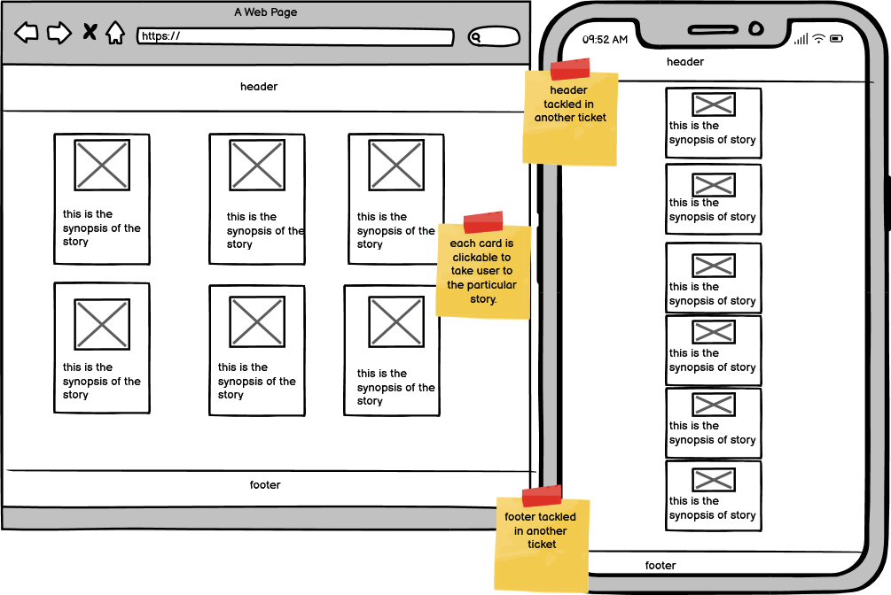

# Spooktacular Stories


Spooktacular Stories is a javascript based interactive story built by team #Zombie Hackers for the Code Institute Halloween Hackathon, PhantomForge.

## Features

* Interactive story with user selected options to control the story
* Multiple images per scene with a random one being selected each time
* Sounds playing on each scence, hand selected to match the theme
* Responsive on all devices
* Replayable due to different web of stories based on selections
* Spooky favicon

## Wireframes


<details>
  <summary>Start Screen
  </summary>


</details>

<details>
  <summary>Storyboard</summary>


</details>

<details>
  <summary>Story Selection</summary>


</details>

<details>
  <summary>Header & Footer</summary>


</details>

<details>
  <summary>End Screen</summary>


</details>


## Adding a new Story

A new story can be added by creating a new json file with the story name under the assets/js/stories folder. It must keep the same structure as the stories already present. Replace details in each section with your own story information.

Inside the assets/js/script.js file, add the story to the storyFiles array at the top of the file:

```
const storyFiles = [
  "desert-island",
  "haunted-forest",
  "haunted-hotel",
  "haunted-mansion",
  "pirate-ship",
];
```

Providing the correct structure of the JSON file, the story will automatically be loaded into the story selection screen and work with only these updates. Custom images will need to be added into the image folder and those links updated in the json, else the default image will be loaded if none are provided.

Sounds for the story can be found in assets/sounds folder. Should new ones be required, they can be uploaded here.

## Testing

## Deployment

### Version Control

The following commands were used to get the code from local machine to github:

```
git add <filename> - Add the file to the queue
git commit -m "message" - Sets the message for the commit
git push - Push all code to safety of github
```

### Github Pages

The site was deployed to Github pages by the following steps:

1. Open the project repository
2. Navigate to the settings tab
3. Select 'Pages' from the left menu
4. Select a branch 'main'
5. Click 'Save'

Live Link: https://dee-mcg.github.io/Hackathon-Project/

### Clone

To clone the project for local use, open your IDE of choice and type the following into the terminal followed by the enter key:

```
git clone https://github.com/Dee-McG/Hackathon-Project.git
```

## Credits

### Tools Used

[Deep AI](https://deepai.org/) - Used to generate most of the images for the story

[chatGPT](https://openai.com/blog/chatgpt) - Used to generate some of the story lines

### Developers

* [Lisa Tinmurth](https://github.com/Mrst12) 
* [Mohamed Ayman](https://github.com/moabdelbasset)
* [Stephen Opoku](https://github.com/Stephenkofipoku)
* [Jack T](https://github.com/JackTubby)
* [Rachel Conlon](https://github.com/rachelconlon)           
* [Dee McGirr](https://github.com/Dee-McG)
            